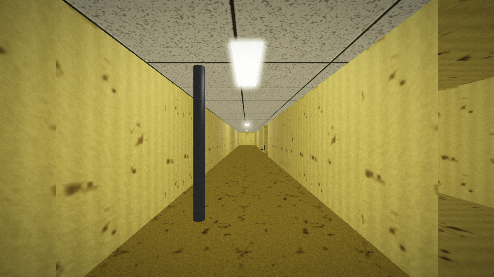

# BACKROOMS — First-Person 3D Horror Game (C++ / OpenGL)

یک بازی سه‌بعدی اول‌شخص با سبک **Backrooms (Level 0)** که کاملاً با **C++17** و **OpenGL 3.3** ساخته شده.
همه‌ی مدل‌ها، تکستچرها، متریال‌ها، **صداها** و افکت‌های نوری به‌صورت **procedural در کد** تولید می‌شوند —
هیچ فایل خارجی (مدل/تکستچر/صدا) لازم نیست و فایل اجرایی کاملاً **مستقل (standalone)** است.

> 🆕 **نسخه نسل بعد (Next-Generation Update):** بازطراحی کامل گرافیک، صدا، نورپردازی،
> رابط کاربری، منوی توقف، دوربین‌های امنیتی، برخورد فیزیکی واقعی و بهینه‌سازی performance.
>
> 🆕🆕 **آپدیت تازه:** افزودن **درهای تله‌پورت (بنفش)** و **درهای خروج (قهوه‌ای)**،
> **مجسمه‌ها/ارواح ترسناک** (برخی شما را تعقیب می‌کنند و وقتی نگاهشان می‌کنید **یخ می‌زنند**)،
> اجرای **تمام‌صفحه (Fullscreen)**، **حذف کامل صدای قدم و دویدن** (راه‌رفتن کاملاً بی‌صدا)،
> **حذف صداهای آزاردهنده/تیز**، **همهمه‌ی طبیعی‌تر لامپ‌ها**، دوربین امنیتی با **لنز واقعی**،
> گرافیک سینمایی قوی‌تر (RTX-like / Bloom) و **دیوارهای جزئیات‌دارتر (وِین‌اسکات/پانل)**.



---

## ✨ امکانات

- 🎮 **کنترل اول‌شخص کامل**
  - `W / A / S / D` — حرکت جلو / چپ / عقب / راست
  - `Mouse` — چرخش دوربین (زاویه دید نرم و واقع‌گرایانه)
  - `Left Shift` — **دویدن واقعی** (سرعت ۷.۶ در برابر ۳.۶ متر بر ثانیه — بیش از دو برابر) همراه با سیستم **Stamina** (استقامت)
  - `Space` — پرش (با گرانش و فیزیک، با محدودیت ارتفاع تا زیر سقف)
  - `F` — روشن/خاموش کردن چراغ‌قوه (Flashlight / Spotlight)
  - `ESC` — باز/بسته کردن **منوی توقف (Pause Menu)**
  - `Enter` / کلیک ماوس — انتخاب در منو

- 🏃 **سیستم دویدن، استقامت، سلامتی و سطح (بازطراحی‌شده)**
  - حرکت **سریع‌تر و پاسخگوتر** (walk 4.2 / sprint 8.4 متر بر ثانیه، شتاب snappier)
  - **سلامتی بیشتر** (تا ۱۵۰) با **بازیابی تدریجی (passive regen)**
  - سیستم **سطح و XP**: با کسب XP لِوِل بالا می‌رود و max health افزایش می‌یابد
  - استقامت با دویدن کم و با راه‌رفتن/ایستادن بازیابی می‌شود؛ حالت‌های وضعیت (injured/winded/exhausted)
  - تغییر FOV هنگام دویدن فقط یک افکت بصری مکمل است

- 🚶 **سیستم راه‌رفتن واقع‌گرایانه**
  - **Head Bobbing**: بالا/پایین و چپ/راست شدن سر هنگام راه رفتن
  - تنفس آرام در حالت ایستا (idle breathing) و کج‌شدن دوربین (camera roll)
  - فرورفتن دوربین هنگام فرود (landing dip) بعد از پرش
  - شتاب‌گیری و کاهش سرعت نرم (acceleration / deceleration)
  - برخورد (collision) AABB با **slide along walls** روی هر محور جداگانه

- 🗺️ **مپ Backrooms عظیم و رویه‌ای (Procedural)**
  - هزارتوی **۴۹×۴۹** تولیدشده با الگوریتم recursive backtracker
  - راهروهای به‌هم‌پیوسته، بن‌بست‌ها، اتاق‌های ذخیره، فضاهای سرویس و نگهداری
  - حلقه‌های اتصالی (loops) برای اکتشاف غیرقابل‌پیش‌بینی
  - **سه ناحیه‌ی متریالی مجزا**: فرش خردلی، کف بتنی، کف کاشی
  - شکستن تکرار بصری با تنوع متریال، تابلوها، آیتم‌ها و نورپردازی

- 🧱 **هندسه‌ی کاملاً سه‌بعدی (بدون شکل اولیه/Placeholder)**
  - دیوارها مکعب‌های توپر **بِوِل‌خورده (beveled)** با ضخامت واقعی
  - همه‌ی وجوه از هر زاویه دیده می‌شوند؛ winding/normal اصلاح‌شده تا سطح ناپدید نشود
  - استوانه‌های درپوش‌دار، slabها برای کف/سقف با ضخامت ۰.۲
  - قرنیز (baseboard) روی وجوه نمایان دیوارها

- 🎨 **تکستچرهای PBR باکیفیت (۵۱۲px)**
  - هر متریال شامل albedo + normal + (roughness/AO/metallic)
  - نویز tileable fBm و worley/cellular برای جزئیات طبیعی
  - لکه، فرسودگی، آسیب آب، درز و کهنگی
  - جداسازی بصری کامل بین دیوار / کف / سقف / آیتم‌ها

- 💡 **نورپردازی فیزیکی و افکت‌های شبیه RTX**
  - **PBR Lighting** (مدل Cook-Torrance: GGX + Fresnel + Smith)
  - تا **۳۲ نور نقطه‌ای** که از خود قاب‌های چراغ سقفی می‌تابند
  - **چشمک‌زدن (flicker)** واقع‌گرایانه: لامپ‌های معیوب با stutter، لامپ‌های سالم با hum/dip
  - **Soft Shadows** با ۵×۵ PCF و کاهش peter-panning
  - **نور محیطی نیمکره‌ای (hemispheric ambient)** آسمان/زمین
  - **مه اتمسفریک (atmospheric fog)** برای عمق و تنش
  - **Bloom** + **HDR + ACES Tonemapping**
  - **Normal Mapping** روی همه سطوح

- 🎞️ **Post-Processing سینمایی**
  - Chromatic Aberration، Film Grain، Vignette و Ordered Dithering

- 🪧 **روایت محیطی (Environmental Storytelling)**
  - ۴۲ تابلوی رویه‌ای روی دیوارها با فونت bitmap داخلی
  - علائم Backrooms: `EXIT`, `NO EXIT`, `LEVEL 0`, `KEEP OUT`, `DANGER`, `SECTOR`, شماره‌ی اتاق‌ها (مثل `RM 3491`)

- 📦 **آیتم‌های مپ (procedural، روی زمین)**
  - جعبه‌های مقوایی با بافت کنگره‌ای (corrugated) و نوار چسب
  - بشکه‌های فلزی (با زنگ‌زدگی)، پالت/میز چوبی
  - لوله‌های فلزی، صندلی پلاستیکی، خرده‌ریز (debris)
  - همه روی سلول‌های باز معتبر قرار می‌گیرند (بدون شناوربودن)

- 🔊 **سیستم صوتی procedural و spatial (بازنگری‌شده برای آرامش)**
  - موتور صوتی مستقل مبتنی بر **miniaudio** (بدون فایل صوتی خارجی — همه‌چیز synthesize می‌شود)
  - 🆕 **حذف کامل صدای قدم و دویدن**: راه‌رفتن روی هر سطح/بلوک **کاملاً بی‌صداست**
  - 🆕 **حذف صداهای تیز/آزاردهنده** (clankهای مکانیکی و zapِ سوختن لامپ حذف شدند — فلیکر فقط بصری است)
  - 🆕 **همهمه‌ی طبیعی‌تر لامپ‌ها**: زمزمه‌ی نرم و گرم با «تنفس» آرام (بدون buzz تیز و بدون tremolo سریع)
  - **همهمه‌ی محیطی (ambience)** و صدای **تهویه (ventilation)** ملایم
  - صدای **موتور/سروو دوربین‌های امنیتی**
  - **صدای فضایی (spatial audio)**: pan و کاهش حجم بر اساس فاصله و جهت منبع
  - تا ۴۸ صدای هم‌زمان با soft-clipping و render callback بدون lock

- 🖥️ **اجرای تمام‌صفحه (Fullscreen)**
  - بازی روی مانیتور اصلی با **رزولوشن بومی (native)** به‌صورت تمام‌صفحه اجرا می‌شود

- 💡 **نورپردازی دینامیک پیشرفته**
  - هر قاب چراغ سقفی **نور واقعی** می‌تاباند با شدت متغیر
  - **لامپ‌های معیوب** که چشمک می‌زنند یا کاملاً می‌میرند و ناحیه را تاریک می‌کنند
  - رفتار **مستقل** هر لامپ (flicker/dip/dead) به همراه افکت صوتی zap

- 🖥️ **رابط کاربری (HUD) مدرن و سینمایی**
  - نوار **سلامتی (Health)**، نوار **استقامت (Stamina)**
  - نشانگر **سطح (Level)** و **تجربه (XP)** با سیستم level-up
  - **چیپ‌های وضعیت (status effects)**: زخمی (injured)، نفس‌بریده (winded)، خسته (exhausted)
  - پنل‌های گرد (rounded SDF panels)، crosshair و vignette اتمسفریک

- ⏸️ **منوی توقف (Pause / Escape Menu)**
  - با کلید `ESC` باز می‌شود: **Resume / Graphics / Audio / Controls / Exit / Quit**
  - زیرمنوهای **Graphics** (کیفیت، روشنایی، bloom، film grain، vsync)
  - زیرمنوی **Audio** (master volume، mute) و **Controls** (راهنمای کلیدها)

- 📹 **سیستم دوربین‌های امنیتی (CCTV) — مدل بهبودیافته**
  - ۸ دوربین مدارّبسته که بازیکن را در خط دید (LOS) **شناسایی و ردیابی** می‌کنند
  - چرخش نرم به سمت بازیکن همراه با **صدای موتور** و **چراغ نشانگر (LED)** قرمز/سبز
  - 🆕 مدل طبیعی‌تر: بازوی باریک، بدنه‌ی کشیده‌ی مخروطی، **بارلِ لنز برجسته** و **عنصر شیشه‌ای لنز (glass lens)** واقعی

- 🧱 **برخورد فیزیکی واقعی (Collision)**
  - علاوه بر دیوارها، **تمام props و مبلمان** (بشکه، لاکر، جعبه، تهویه) دارای collision mesh هستند
  - clamp مرزی نقشه + رفع باگ **پرش روی دیوار** برای دیدزدن آن‌سو
  - سقف روی **تمام سلول‌ها** بسته شده (رفع exploit ارتفاع دیوار)

- ✍️ **نوشته‌های دست‌خط روی دیوار (بدون پس‌زمینه رنگی)**
  - نوشته‌ها مثل **ماژیک/رنگ/گچ/زغال** مستقیم روی دیوار رندر می‌شوند (decal شفاف)
  - ۴ سبک: ماژیک مشکی، رنگ قرمز، زغال، گچ — با جوهرِ ناهموار و واقع‌گرایانه
  - پیام‌های ترسناک: `HELP ME`, `IT SEES YOU`, `DAY 47`, `NO EXIT`, `X X X` و …

- 🚪 **درهای ویژه (Doors) با نشانه‌های راهنما**
  - **درِ تله‌پورت (بنفش)**: با احتمال یافته‌شدن بالاتر (~۳۵٪)؛ با ورود به آن، بازیکن به یک نقطه‌ی تصادفی روی مپ **تله‌پورت** می‌شود
  - **درِ خروج (قهوه‌ای)**: با احتمال ~۲۵٪ و دقیقاً **۳ عدد** روی کل مپ؛ **در پایانی بازی** است (با ورود به آن بازی برده می‌شود)
  - هر در دارای **هاله‌ی نورانی (emissive aura)** و **چیپ‌های نشانگر روی کف (floor markers)** برای کمک به پیدا کردنش است
  - هنگام نزدیک‌شدن، پیامِ راهنما روی HUD نمایش داده می‌شود (`PURPLE DOOR NEAR — TELEPORT` / `BROWN DOOR NEAR — EXIT`)

- 🧍‍♂️ **مجسمه‌ها / ارواح ترسناک (Statues / Ghosts)**
  - مدل‌های انسان‌نمای بی‌چهره و رنگ‌پریده با چشمان قرمز درخشان — **مکان ثابت (غیرتصادفی)** و **کم‌تعداد (sparse)**
  - بیشترشان **ثابت و دلهره‌آور** هستند؛ گاهی یک مجسمه‌ی ثابت **ناگهان به سمت بازیکن می‌چرخد** و نگاه می‌کند
  - **برخی تعقیب‌کننده** هستند: به‌سمت بازیکن می‌خزند ولی لحظه‌ای که **نگاهشان کنید یخ می‌زنند (Freeze)**
  - تعقیب‌کننده‌ها هرگز از یک **حداقل فاصله** نزدیک‌تر نمی‌شوند؛ راه فرار: **نگاه کردن به آن‌ها و عقب‌عقب دور شدن**

- 🧍 **بدون هیچ موجود متحرک دیگری** — تنها شما، مجسمه‌ها، و دوربین‌هایی که می‌بینند…


---

## ▶️ اجرا (Windows)

فقط کافیست فایل آماده را اجرا کنید:

```
build\Backrooms.exe
```

فایل `Backrooms.exe` کاملاً **static** است (بدون نیاز به DLL یا نصب چیزی).
روی ویندوز ۶۴-بیتی با کارت گرافیک سازگار با OpenGL 3.3 اجرا می‌شود.

---

## 🛠️ ساخت از روی سورس (Build)

### روی لینوکس (cross-compile به Windows + native)

```bash
./build.sh
```

این اسکریپت هم `build/Backrooms.exe` (ویندوز) و هم `build/Backrooms` (لینوکس) را می‌سازد.

پیش‌نیازها:
```bash
sudo apt-get install mingw-w64 g++ libglfw3-dev libglm-dev
```

> صدا (`miniaudio`) در پوشه‌ی `deps/miniaudio` قرار دارد و نیاز به نصب جداگانه ندارد.
> فایل سنگین miniaudio یک‌بار کامپایل و در `.objcache/` ذخیره می‌شود تا build‌های بعدی سریع باشند.

### روی ویندوز (با MinGW-w64)

```bat
build_windows.bat
```

---

## 📁 ساختار پروژه

```
.
├── src/
│   ├── main.cpp        # حلقه اصلی، رندر، دوربین‌ها، منو، HUD، culling، post-processing
│   ├── shaders.h       # شیدرهای GLSL (PBR, shadow, bloom, composite, decal, UI)
│   ├── textures.h      # تولید procedural تکستچر، دکال دست‌خط، متریال‌ها
│   ├── geometry.h      # مش‌های procedural (cube, cylinder, barrel, locker, vent box)
│   ├── map.h           # طرح مپ Backrooms + برخورد دیوار + رجیستری obstacle
│   ├── player.h        # کنترلر بازیکن (head-bob, jump, sprint, health/XP, collision)
│   ├── audio.h         # 🆕 موتور صوتی procedural (miniaudio) + synth و spatial
│   ├── ma_impl.c       # 🆕 واحد ترجمه‌ی miniaudio (trimmed, cached)
│   └── ui.h            # 🆕 رندرر immediate-mode UI + font atlas
├── deps/               # GLFW (win), GLM, GLAD, miniaudio
├── build/
│   └── Backrooms.exe   # ✅ خروجی اجرایی ویندوز (standalone)
├── build.sh
├── build_windows.bat
└── README.md
```

---

## ⚙️ جزئیات فنی

| موضوع | پیاده‌سازی |
|------|-----------|
| پنجره و ورودی | GLFW 3.4 |
| لود توابع OpenGL | GLAD (OpenGL 3.3 Core) |
| ریاضیات | GLM |
| رندر | Deferred-ish: shadow pass → HDR pass → bloom → composite |
| تکستچر | تولید procedural با value-noise / fBm روی CPU |
| سایه | Shadow mapping با depth FBO (2048²) و PCF 5×5 |
| مپ | تولید رویه‌ای: recursive-backtracker maze + حفر اتاق + حلقه + zone tagging |
| برخورد | AABB دایره-در-جعبه با لغزش جداگانه روی هر محور + رجیستری obstacle برای props |
| صدا | miniaudio (WASAPI/WinMM) — synthesis کامل روی منبع؛ تا ۴۸ صدا، spatial pan/distance |
| UI | immediate-mode 2D overlay با SDF rounded panels و glyph atlas (فونت 5×7) |
| دوربین امنیتی | LOS detection + pan tracking + servo audio + LED indicator |
| بهینگی | **Frustum culling** با ۶ صفحه از viewProj؛ shadow distance cull؛ shadow res / bloom passes متناسب با کیفیت؛ فقط ۳۲ لامپ نزدیک؛ miniaudio جداگانه و cache-شده |

> توجه: «RTX» سخت‌افزاری (ray tracing با DXR/Vulkan-RT) به سخت‌افزار و API خاص نیاز دارد.
> در این پروژه ظاهر و افکت‌های نزدیک به RTX (PBR، سایه نرم، bloom، HDR، normal mapping)
> با شیدرهای سفارشی پیاده‌سازی شده‌اند.

---

## 📜 لایسنس

تمام کد، مدل‌ها و تکستچرها اصل و تولیدشده در همین پروژه هستند.
